# Session 3 Assignment: Full-Stack Hot Mess Coach (Backend + Optional Frontend)

This Mermaid diagram illustrates the complete assignment workflow, showing how it builds upon the Breakout Room foundation and progresses to full-stack development.

```mermaid
flowchart TD
    Start([Start: Session 3 Assignment]) --> Foundation

    %% Foundation from Breakout Room
    subgraph Foundation[Foundation from Breakout Room]
        direction TB
        F1[✓ GitFlow & Cursor Rules Setup]
        F2[✓ Basic FastAPI Structure Knowledge]
        F3[✓ Local Testing with uvicorn]
        F4[✓ Vercel Deployment Experience]
        F5[✓ STEP1: Basic LLM Endpoint]
        F1 --> F2 --> F3 --> F4 --> F5
    end

    Foundation --> Part1

    %% Part 1: Backend (Required)
    subgraph Part1[Part 1: Backend - Required 🐍☁️]
        direction TB

        subgraph Step1[Step 1: Set Up Environment]
            A1[Add gitflow_rules.md] --> A2[Add cursor_rules.md]
            A2 --> A3[Context Engineering Ready]
        end

        subgraph Step2[Step 2: Scaffold FastAPI Backend]
            B1[Clone GitHub Repo] --> B2[Create api/ Directory]
            B2 --> B3[Copy STEP4_app_llm.py to api/index.py]
            B3 --> B3a{Note: STEP4 vs STEP1}
            B3a -->|More Advanced| B3b[STEP4 includes document analysis]
            B3b --> B4[Copy requirements.txt & pyproject.toml]
            B4 --> B5[Copy vercel.json]
            B5 --> B6[Run: uv sync]
            B6 --> B7{Test Locally}
            B7 -->|uvicorn| B8[Visit localhost:8000]
            B8 --> B9[Test /docs endpoint]
            B9 --> B10{Working?}
            B10 -->|No| B7
            B10 -->|Yes| B11[Backend Ready ✓]
        end

        subgraph Step3[Step 3: Deploy Backend to Vercel]
            C1[git add .] --> C2[git commit -m 'adding files']
            C2 --> C3[git push origin main]
            C3 --> C4[vercel --prod]
            C4 --> C5[Set OPENAI_API_KEY in Vercel]
            C5 --> C6{Deployment Success?}
            C6 -->|No| C7[Debug & Fix]
            C7 --> C4
            C6 -->|Yes| C8[Backend Live ✓]
        end

        Step1 --> Step2
        Step2 --> Step3
    end

    Part1 --> Decision1

    %% Decision Point
    Decision1{Continue to Advanced?}
    Decision1 -->|Required Complete| End1([Assignment Complete - Backend Only])
    Decision1 -->|Yes - Go Advanced| Part2

    %% Part 2: Full-Stack (Advanced)
    subgraph Part2[Part 2: Advanced - Full-Stack 🎨⚡]
        direction TB

        subgraph Step4[Step 4: Choose Frontend]
            D1{Frontend Strategy}
            D1 -->|Option A| D2[Reuse Hot Mess Tracker from Session 2]
            D1 -->|Option B| D3[Generate New Frontend in v0]
            D2 --> D4[Frontend Choice Made]
            D3 --> D4
        end

        subgraph Step5[Step 5: Generate v0 Frontend with Backend Awareness]
            E1[Prepare v0 Prompt] --> E2[Upload Backend Code to v0]
            E2 --> E3[Specify Backend Endpoint: POST /chat]
            E3 --> E4[Define Request Format: message]
            E4 --> E5[Request: React + Tailwind + shadcn/ui]
            E5 --> E6[Add Playful UI Elements]
            E6 --> E7[Download Generated Code]
            E7 --> E8[npm install]
            E8 --> E9[Test with npm run dev]
            E9 --> E10{Frontend Works Locally?}
            E10 -->|No| E11[Debug with Cursor]
            E11 --> E9
            E10 -->|Yes| E12[Frontend Scaffolding Ready ✓]
        end

        subgraph Step6[Step 6: Connect Frontend → Backend]
            F1[Ask Cursor to Create Connection] --> F2[Update API Endpoint URLs]
            F2 --> F3[Configure CORS if needed]
            F3 --> F4[Test Backend Locally]
            F4 --> F4a[Run: uv run uvicorn api.index:app --reload]
            F4a --> F5[Test Frontend Locally]
            F5 --> F5a[Run: npm run dev on port 3000]
            F5a --> F6{Full Integration Working?}
            F6 -->|No| F7[Debug Connection]
            F7 --> F2
            F6 -->|Yes| F8[Request Cursor to Create README]
            F8 --> F9[Document Setup Instructions]
            F9 --> F10[Local Full-Stack Ready ✓]
        end

        subgraph Step7[Step 7: Deploy Frontend to Vercel]
            G1[Update Backend URL in Frontend] --> G2[Point to Production Backend]
            G2 --> G3[git add .]
            G3 --> G4[git commit -m 'adding frontend']
            G4 --> G5[git push origin main]
            G5 --> G6[vercel --prod]
            G6 --> G7{Frontend Deployed?}
            G7 -->|No| G8[Check Build Logs]
            G8 --> G6
            G7 -->|Yes| G9[Test Frontend → Backend Connection]
            G9 --> G10{E2E Working?}
            G10 -->|No| G11[Debug Production Issues]
            G11 --> G1
            G10 -->|Yes| G12[Full-Stack Live ✓]
        end

        Step4 --> Step5
        Step5 --> Step6
        Step6 --> Step7
    end

    Part2 --> Activity1

    %% Activity Section
    subgraph Activity1[Activity #1: Your Full-Stack Hot Mess Coach]
        direction TB
        H1{What Did You Build?}
        H1 -->|Required| H2[FastAPI Backend with LLM]
        H1 -->|Advanced| H3[Backend + Frontend Integration]
        H2 --> H4[Deploy Backend]
        H3 --> H5[Deploy Both Services]
        H4 --> H6[Share & Celebrate]
        H5 --> H6
    end

    Activity1 --> End2([Assignment Complete - Full-Stack! 🎉])

    %% Styling
    classDef foundationStyle fill:#e3f2fd,stroke:#1565c0,stroke-width:3px,stroke-dasharray: 5 5
    classDef setupStyle fill:#e1f5ff,stroke:#0288d1,stroke-width:2px
    classDef backendStyle fill:#fff3e0,stroke:#f57c00,stroke-width:2px
    classDef deployStyle fill:#e8f5e9,stroke:#388e3c,stroke-width:2px
    classDef frontendStyle fill:#fce4ec,stroke:#c2185b,stroke-width:2px
    classDef integrationStyle fill:#f3e5f5,stroke:#7b1fa2,stroke-width:2px
    classDef activityStyle fill:#fff9c4,stroke:#f57f17,stroke-width:2px
    classDef decisionStyle fill:#ffebee,stroke:#c62828,stroke-width:2px

    class Foundation foundationStyle
    class Step1 setupStyle
    class Step2,Step4 backendStyle
    class Step3,Step7 deployStyle
    class Step5 frontendStyle
    class Step6 integrationStyle
    class Activity1 activityStyle
    class Decision1 decisionStyle
```



## How Assignment Builds on Breakout Room

### Foundation Established in Breakout Room:
1. ✓ **GitFlow & Cursor Rules** - Context engineering fundamentals
2. ✓ **FastAPI Basics** - Creating `api/` structure, using `uvicorn`
3. ✓ **Local Testing** - Understanding localhost:8000 and /docs
4. ✓ **Vercel Deployment** - Basic deployment workflow
5. ✓ **STEP1 LLM Endpoint** - Simple chat endpoint (no UI, no documents)

### Assignment Progression:

#### Part 1 (Required) - Enhanced Backend
- **STEP4 vs STEP1**: Assignment uses `STEP4_app_llm.py` instead of `STEP1_app_llm.py`
  - STEP1: Basic LLM chat endpoint only
  - STEP4: Advanced features with document upload/analysis capabilities
- **Same Deployment Pattern**: Reinforces Vercel deployment learned in Breakout Room
- **Environment Management**: Same `uv`, `pyproject.toml`, `vercel.json` pattern

#### Part 2 (Advanced) - Full-Stack Integration
- **New Territory**: Frontend development builds on Session 2 skills
- **v0 with Backend Awareness**: Advanced prompt engineering (upload backend code to v0)
- **Full-Stack Workflow**: Learn to connect separate frontend/backend deployments
- **Dual Deployment**: Deploy backend and frontend as separate Vercel apps

### Progressive Complexity Ladder

```
Session 2 Breakout Room → Frontend Only (v0 → Vercel)
                          ↓
Session 3 Breakout Room → Backend Only (STEP1 → Vercel)
                          ↓
Session 3 Assignment → Enhanced Backend (STEP4 → Vercel)
                          ↓
Session 3 Assignment Advanced → Full-Stack (Backend + Frontend)
```

## Sample Scripts Progression

The assignment workflow maps to the sample scripts:

| Script | Features | Used In |
|--------|----------|---------|
| **STEP0_app_html.py** | Basic HTML, no LLM | Learning resource |
| **STEP1_app_llm.py** | LLM endpoint, no UI | **Breakout Room** |
| **STEP2_app_llm_html.py** | LLM + HTML UI | Learning resource |
| **STEP3_app_llm_st.py** | LLM + Streamlit UI | Learning resource |
| **STEP4_app_llm_st_doc.py** | LLM + Streamlit + Docs | **Assignment** |

## Key Architectural Patterns

### Part 1: Backend Development
1. **Isolation → Integration**: Build features separately, then integrate
2. **Local First**: Test thoroughly locally before deploying
3. **Environment Management**: Use `.env` locally, Vercel dashboard for production
4. **API Structure**: All backend logic in `api/index.py`

### Part 2: Full-Stack Integration
1. **Separation of Concerns**: Backend and frontend as separate services
2. **API Contract**: Clear endpoint definition (`POST /chat` with `{message: "text"}`)
3. **One-Shot Vibecoding**: Upload backend code to v0 for context-aware generation
4. **Dual Deployment**: Independent deployment of frontend and backend
5. **Connection Pattern**: Frontend (port 3000) → Backend (port 8000) locally

## Tips for Success

### Required (Backend Only)
- ✅ Use `STEP4_app_llm.py` (not STEP1) for enhanced features
- ✅ Test document upload features if using STEP4
- ✅ Verify Swagger docs at `/docs` endpoint
- ✅ Set `OPENAI_API_KEY` in Vercel dashboard

### Advanced (Full-Stack)
- ✅ Upload your backend code when prompting v0 for context
- ✅ Specify exact endpoint (`POST /chat`) and request format
- ✅ Test locally first (backend on 8000, frontend on 3000)
- ✅ Update frontend config to point to production backend URL
- ✅ Use Cursor to help connect frontend/backend and create README

## Common Pitfalls

### Backend Deployment
1. Forgetting `OPENAI_API_KEY` in Vercel
2. Wrong file structure (must be `api/index.py`)
3. Not testing locally first
4. Missing `vercel.json` routing configuration

### Full-Stack Integration
1. Frontend still pointing to localhost instead of production URL
2. CORS issues (backend must allow frontend origin)
3. Different environments between local and production
4. Not documenting setup in README
5. Deploying frontend before backend is ready

## Deliverables

### Required
- ✅ FastAPI backend with LLM endpoint
- ✅ Deployed to Vercel
- ✅ Working `/chat` endpoint

### Advanced
- ✅ v0-generated frontend
- ✅ Frontend deployed to Vercel
- ✅ Frontend → Backend connection working in production
- ✅ README with setup instructions
