# Session 3 Breakout Room: Build & Deploy Hot Mess Coach Backend

This Mermaid diagram illustrates the progressive sequence of activities in the Session 3 Breakout Room, showing how each step builds upon the previous one.

```mermaid
flowchart TD
    Start([Start: Session 3 Breakout Room]) --> Step1

    %% Step 1: Setup
    subgraph Step1[Step 1: Add GitFlow + Cursor Rules]
        direction TB
        A1[Add gitflow_rules.md] --> A2[Add cursor_rules.md]
        A2 --> A3[Enable AI-Assisted Development Context]
    end

    Step1 --> Step2

    %% Step 2: Create FastAPI App
    subgraph Step2[Step 2: Create FastAPI Hot Mess Coach App]
        direction TB
        B1[Clone GitHub Repo] --> B2[Create api/ Directory]
        B2 --> B3[Copy STEP1_app_llm.py to api/index.py]
        B3 --> B4[Copy requirements.txt & pyproject.toml]
        B4 --> B5[Copy vercel.json for Deployment]
        B5 --> B6[Run: uv sync]
        B6 --> B7{Test Locally}
        B7 -->|Run uvicorn| B8[Visit localhost:8000]
        B8 --> B9[Visit localhost:8000/docs]
        B9 --> B10{Working?}
        B10 -->|No| B7
        B10 -->|Yes| B11[Local Backend Ready ✓]
    end

    Step2 --> Step3

    %% Step 3: Deploy to Vercel
    subgraph Step3[Step 3: Deploy FastAPI Backend to Vercel]
        direction TB
        C1[git add .] --> C2[git commit -m 'adding files']
        C2 --> C3[git push origin main]
        C3 --> C4[Run: vercel --prod]
        C4 --> C5[Add OPENAI_API_KEY in Vercel Dashboard]
        C5 --> C6{Deployment Successful?}
        C6 -->|No| C7[Check Logs & Debug]
        C7 --> C4
        C6 -->|Yes| C8[Backend Live on Vercel ✓]
    end

    Step3 --> Activity1

    %% Activity 1: Experiment
    subgraph Activity1[Activity #1: Experiment & Customize]
        direction TB
        D1[Create Your Own Repo] --> D2[Customize .py File]
        D2 --> D3[Create .env for API Keys]
        D3 --> D4[Implement Extra Features]
        D4 --> D5{Use GitFlow}
        D5 --> D6[Create Feature Branches]
        D6 --> D7[Open Pull Requests]
        D7 --> D8[Merge Following Best Practices]
        D8 --> D9[Deploy Updated Backend to Vercel]
        D9 --> D10[Iterate & Improve]
    end

    Activity1 --> End([Backend AI App Complete! 🎉])

    %% Styling
    classDef setupStyle fill:#e1f5ff,stroke:#0288d1,stroke-width:2px
    classDef devStyle fill:#fff3e0,stroke:#f57c00,stroke-width:2px
    classDef deployStyle fill:#e8f5e9,stroke:#388e3c,stroke-width:2px
    classDef experimentStyle fill:#f3e5f5,stroke:#7b1fa2,stroke-width:2px

    class Step1 setupStyle
    class Step2 devStyle
    class Step3 deployStyle
    class Activity1 experimentStyle
```

## Key Learning Progression

### Phase 1: Foundation (Step 1)
- **GitFlow Rules**: Enable professional branch management and multi-agent workflow
- **Cursor Rules**: Set up context engineering for consistent AI-generated code
- **Outcome**: Development environment configured for AI-assisted coding

### Phase 2: Build (Step 2)
- **Repository Setup**: Clone and structure project with `api/` folder
- **FastAPI Integration**: Start with STEP1 (basic LLM endpoint)
- **Local Testing**: Verify backend works before deployment
- **Outcome**: Working FastAPI backend with LLM chat endpoint running locally

### Phase 3: Ship (Step 3)
- **Git Workflow**: Add, commit, push to GitHub
- **Vercel Deployment**: Deploy backend to production
- **Environment Configuration**: Securely add API keys
- **Outcome**: Live backend accessible via Vercel URL

### Phase 4: Iterate (Activity #1)
- **Customization**: Build unique features on top of foundation
- **GitFlow Practice**: Use feature branches and pull requests
- **Continuous Deployment**: Deploy updates iteratively
- **Outcome**: Personalized backend with custom features

## Progressive Complexity

The breakout room follows a deliberate progression:

1. **STEP1_app_llm.py** → Basic LLM endpoint (no UI)
2. Students can explore further steps independently:
   - STEP0: Just HTML (no LLM)
   - STEP2: LLM + HTML UI
   - STEP3: LLM + Streamlit UI
   - STEP4: LLM + Streamlit + Document Upload

## Testing Points

- **Local**: `http://localhost:8000` (main app) and `http://localhost:8000/docs` (Swagger)
- **Production**: Vercel deployment URL
- **Environment**: Test with `.env` locally, environment variables in Vercel

## Common Pitfalls

1. Forgetting to run `uv sync` before local testing
2. Not setting `OPENAI_API_KEY` in Vercel dashboard
3. Incorrect file structure (API files must be in `api/` folder)
4. Not testing locally before deploying
5. Skipping GitFlow best practices in Activity #1
