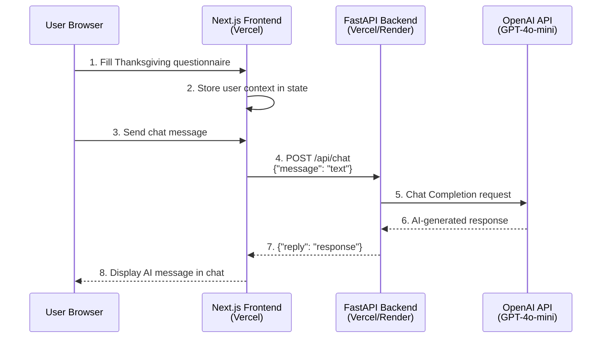

# Student Guide: Hot Mess Coach at Thanksgiving

## TL;DR

You will build and deploy a **complete full-stack AI application** with:
- **Backend**: FastAPI service that talks to OpenAI's GPT-4o-mini
- **Frontend**: Next.js React app with a fun Thanksgiving-themed chat interface
- **Deployment**: Both components live on Vercel (or backend on Render)

By the end, you'll have a shareable URL where anyone can chat with your AI coach!

---

## Prerequisites

Before starting, make sure you have these installed:

### Required
- **Python 3.10+** - Check with `python --version`
- **Node.js 18+** - Check with `node --version`
- **npm** - Comes with Node.js
- **Git** - For version control
- **OpenAI API Key** - Get one from [platform.openai.com](https://platform.openai.com)

### Recommended Package Managers
**For Python (choose one):**
- **uv** (recommended for this course) - Fast, modern Python package manager
  ```bash
  # Install uv (macOS/Linux)
  curl -LsSf https://astral.sh/uv/install.sh | sh

  # Or using pip
  pip install uv
  ```
- **venv + pip** (standard alternative) - Built into Python
  ```bash
  python3 -m venv .venv
  source .venv/bin/activate  # macOS/Linux
  # .venv\Scripts\activate   # Windows
  ```

### Deployment Tools
**Vercel CLI** (install when needed in Phase 3):
```bash
# Install Vercel CLI globally
npm install -g vercel

# Login to your Vercel account
vercel login
```

### Accounts Needed
- **GitHub Account** - For repository hosting
- **Vercel Account** - For deployment (sign up at [vercel.com](https://vercel.com))
- **v0.dev Account** - For AI frontend generation (sign up at [v0.dev](https://v0.dev))
- **Optional: Render Account** - Alternative backend deployment

---

## Architecture Overview



---

## What You're Building

### 🎯 Final Product
A Thanksgiving coaching chatbot that:
1. Asks users about their Thanksgiving situation (family size, chaos level, etc.)
2. Uses that context to provide humorous, helpful advice via AI chat
3. Looks great on desktop and mobile
4. Is deployed and accessible to anyone with the URL

### 🔧 Technical Components

**Backend** ([backend-hot-mess-coach/](aie_challenge_hotmess/backend-hot-mess-coach/))
- **Framework**: FastAPI (Python)
- **API Endpoint**: `POST /api/chat` - accepts message, returns AI reply
- **Integration**: OpenAI Python SDK → GPT-4o-mini
- **Environment**: Needs `OPENAI_API_KEY`
- **Port**: Runs on 8000 locally

**Frontend** ([frontend-hot-mess-coach/](aie_challenge_hotmess/frontend-hot-mess-coach/))
- **Framework**: Next.js 16 + React 19 + TypeScript
- **UI Library**: shadcn/ui components + Tailwind CSS
- **Features**: Questionnaire form → Chat interface
- **Environment**: Needs `NEXT_PUBLIC_BACKEND_URL`
- **Port**: Runs on 3000 locally

---

## High-Level Roadmap

### Phase 1: Repository Setup
**What**: Get the starter code into your own GitHub repository
**Why**: You need your own repo to deploy to Vercel
**Output**: Your GitHub repo with backend code ready to run

```bash
# Create empty repo on GitHub
# Clone it locally
# Add AIE-challenge as upstream remote
# Pull backend code from upstream
# Push to your own repo
```

---

### Phase 2: Test Backend Locally
**What**: Run the FastAPI server on your machine
**Why**: Verify the backend works before deploying
**Output**: Backend running at http://localhost:8000 responding to chat requests

```bash
# Navigate to backend directory from project root
cd aie_challenge_hotmess/backend-hot-mess-coach/

# Install dependencies
uv sync

# Set your OpenAI API key
export OPENAI_API_KEY="sk-..."

# Start the backend server
uv run uvicorn api.index:app --reload --host 0.0.0.0 --port 8000
```

Once running, **test your backend** in a new terminal:

```bash
# Test health endpoint
curl http://localhost:8000

# Expected output:
# {"status": "ok"} or similar health check response

# Test chat endpoint
curl -X POST http://localhost:8000/api/chat \
     -H "Content-Type: application/json" \
     -d '{"message": "Hello, Hot Mess Coach!"}'

# Expected output:
# {"reply": "AI-generated response about Thanksgiving here..."}
```

> **Note**: The `/api/` prefix is required - don't try just `/chat`!

**Alternative using venv + pip**:
```bash
cd aie_challenge_hotmess/backend-hot-mess-coach/
python3 -m venv .venv
source .venv/bin/activate  # macOS/Linux
# .venv\Scripts\activate   # Windows
pip install -r requirements.txt
export OPENAI_API_KEY="sk-..."
uvicorn api.index:app --reload --host 0.0.0.0 --port 8000
```

**Key Files**:
- [api/index.py](aie_challenge_hotmess/backend-hot-mess-coach/api/index.py) - Main FastAPI app with `/api/chat` endpoint
- `requirements.txt` or `pyproject.toml` - Python dependencies
- `vercel.json` - Deployment configuration

---

### Phase 3: Deploy Backend to Vercel
**What**: Push your backend to the cloud
**Why**: Get a public URL that your frontend can call
**Output**: Public backend URL (e.g., `https://your-backend.vercel.app`)

#### Option A: Deploy to Vercel (Recommended for Beginners)

**Step 1: Install and login to Vercel CLI** (if not already done):
```bash
# Install Vercel CLI globally
npm install -g vercel

# Login to your Vercel account
vercel login
```

**Step 2: Deploy from your backend directory**:
```bash
# Make sure you're in the backend directory
cd aie_challenge_hotmess/backend-hot-mess-coach/

# Deploy to production
vercel --prod
```

**Step 3: Add environment variables** (CRITICAL - don't skip!):
1. Go to [vercel.com/dashboard](https://vercel.com/dashboard)
2. Click on your backend project
3. Go to **Settings** → **Environment Variables**
4. Click **Add New**
5. Add:
   - **Key**: `OPENAI_API_KEY`
   - **Value**: Your OpenAI API key (starts with `sk-...`)
   - **Environments**: Select all (Production, Preview, Development)
6. Click **Save**
7. Go to **Deployments** tab → Click ⋯ on latest deployment → **Redeploy**

> ⚠️ **Important**: Environment variables only take effect after redeployment!

**Step 4: Test your deployed backend**:
```bash
# Replace YOUR_BACKEND_URL with your actual Vercel URL
curl -X POST https://YOUR_BACKEND_URL.vercel.app/api/chat \
     -H "Content-Type: application/json" \
     -d '{"message": "Test from production!"}'
```

#### Option B: Deploy to Render (Alternative for Long-Running Processes)

**When to choose Render:**
- ✅ Need longer request timeouts
- ✅ Want more control over server configuration
- ✅ Prefer traditional server deployment model

**When to choose Vercel:**
- ✅ Easiest setup and deployment
- ✅ Automatic GitHub integration
- ✅ Good for typical API requests (< 10 seconds)

**Render Deployment** (see detailed instructions in [BreakoutRoom.md](BreakoutRoom.md), lines 247-297)

---

### Phase 4: Generate Frontend with v0.dev
**What**: Use AI to create your React frontend
**Why**: v0 generates production-ready Next.js code based on your backend API
**Output**: Downloaded frontend code with questionnaire + chat UI

**Step 1: Go to [v0.dev](https://v0.dev)** and sign in

**Step 2: Upload your backend code** (IMPORTANT!)
- Click the "📎" attachment icon
- Upload `aie_challenge_hotmess/backend-hot-mess-coach/api/index.py`
- This gives v0 context about your API structure

**Step 3: Use this prompt template** (replace `YOUR_BACKEND_URL` with your actual Vercel URL):
```
Create a frontend called "Hot Mess Coach UI" for a Thanksgiving coaching app.

Backend API:
POST https://YOUR_BACKEND_URL.vercel.app/api/chat
Request: {"message": "text"}
Response: {"reply": "AI response"}

Requirements:
- React + Next.js + TypeScript + Tailwind CSS
- shadcn/ui components (Button, Card, Input, etc.)
- Interactive Thanksgiving questionnaire (family size, chaos level, dietary restrictions)
- Chat interface with message bubbles and loading states
- Fun, humorous Thanksgiving theme with turkey imagery
- Mobile responsive design
- Error handling for API failures
```

**Step 4: Review and refine** the generated code in v0's interface

**Step 5: Download** the code when you're satisfied (look for "Download" or "Export" button)

---

### Phase 5: Test Frontend Locally
**What**: Run the Next.js app on your machine and connect to your local backend
**Why**: Verify the full stack works before deploying frontend
**Output**: Frontend at http://localhost:3000 successfully chatting with backend

```bash
# Navigate to frontend directory from project root
cd aie_challenge_hotmess/frontend-hot-mess-coach/

# Install dependencies
npm install

# Create .env.local file to point to LOCAL backend for testing
echo "NEXT_PUBLIC_BACKEND_URL=http://localhost:8000" > .env.local

# Start the development server
npm run dev
```

> **Why `NEXT_PUBLIC_` prefix?** Next.js only exposes environment variables to the browser if they start with `NEXT_PUBLIC_`. Without this prefix, your frontend won't be able to access the backend URL!

**Important**: Make sure backend is running on port 8000 at the same time!

**Open two terminals side-by-side:**
- Terminal 1: Backend running on :8000
- Terminal 2: Frontend running on :3000

**Key Files**:
- `app/page.tsx` - Main page with state management
- `components/thanksgiving-chat.tsx` - Chat UI component
- `components/thanksgiving-questionnaire.tsx` - Form component

---

### Phase 6: Deploy Frontend to Vercel
**What**: Push your frontend to the cloud
**Why**: Make your app publicly accessible
**Output**: Public frontend URL (e.g., `https://your-frontend.vercel.app`)

**Step 1: Deploy from frontend directory**:
```bash
# Make sure you're in the frontend directory
cd aie_challenge_hotmess/frontend-hot-mess-coach/

# Deploy to production
vercel --prod
```

**Step 2: Add environment variable** (CRITICAL!):
1. Go to [vercel.com/dashboard](https://vercel.com/dashboard)
2. Click on your **frontend** project (not backend!)
3. Go to **Settings** → **Environment Variables**
4. Click **Add New**
5. Add:
   - **Key**: `NEXT_PUBLIC_BACKEND_URL`
   - **Value**: Your deployed backend URL (e.g., `https://your-backend.vercel.app`)
   - **Environments**: Select all (Production, Preview, Development)
6. Click **Save**
7. Go to **Deployments** tab → Click ⋯ → **Redeploy**

> ⚠️ **Critical**: The URL should be your DEPLOYED backend, not `http://localhost:8000`!
>
> ⚠️ **No trailing slash**: Use `https://your-backend.vercel.app`, NOT `https://your-backend.vercel.app/`

---

### Phase 7: Connect Frontend to Backend
**What**: Update frontend to call your deployed backend (not localhost)
**Why**: Connect the two pieces of your full-stack app
**Output**: Frontend and backend talking to each other in production

**In Vercel Dashboard** (for your frontend project):
1. Settings → Environment Variables
2. Add: `NEXT_PUBLIC_BACKEND_URL` = `https://your-backend.vercel.app`
3. Save and **Redeploy**

---

### Phase 8: Test End-to-End
**What**: Use your deployed app like a real user
**Why**: Verify everything works in production
**Output**: Fully functional app ready to share!

**Test Checklist**:
- ✅ **Backend health**: Visit `https://your-backend.vercel.app` (should return JSON)
- ✅ **Backend API**: Test with curl:
  ```bash
  curl -X POST https://your-backend.vercel.app/api/chat \
       -H "Content-Type: application/json" \
       -d '{"message": "Test"}'
  ```
- ✅ **Frontend loads**: Visit your frontend URL
- ✅ **Questionnaire works**: Fill out the Thanksgiving questionnaire
- ✅ **Chat sends**: Send a chat message
- ✅ **AI responds**: Receive AI-generated reply
- ✅ **Multiple messages**: Try several back-and-forth messages
- ✅ **Mobile responsive**: Test on mobile device or browser dev tools
- ✅ **Share with friend**: Send URL to someone else to verify it works

---

## Quick Reference

### Running Both Services Locally

**Terminal 1 - Backend**:
```bash
cd aie_challenge_hotmess/backend-hot-mess-coach/
export OPENAI_API_KEY="sk-..."
uv run uvicorn api.index:app --reload --host 0.0.0.0 --port 8000
```

**Terminal 2 - Frontend**:
```bash
cd aie_challenge_hotmess/frontend-hot-mess-coach/
export NEXT_PUBLIC_BACKEND_URL="http://localhost:8000"
npm run dev
```

**Visit**: http://localhost:3000

> **Tip**: Keep both terminals visible so you can see logs from both services!

---

### Environment Variables Cheat Sheet

| Service | Variable | Local Value | Production Value | Why It's Needed |
|---------|----------|-------------|------------------|-----------------|
| Backend | `OPENAI_API_KEY` | `sk-...` | `sk-...` (set in Vercel) | Authenticate with OpenAI API |
| Frontend | `NEXT_PUBLIC_BACKEND_URL` | `http://localhost:8000` | `https://your-backend.vercel.app` | Tell frontend where to send API requests |

> **Remember**: The `NEXT_PUBLIC_` prefix is required for Next.js to expose the variable to the browser. Server-side variables don't need this prefix.

---

### Common Issues & Fixes

**Backend won't start**:
- ✅ Check `OPENAI_API_KEY` is set: `echo $OPENAI_API_KEY`
- ✅ Run `uv sync` to install dependencies
- ✅ Check if port 8000 is in use:
  ```bash
  # macOS/Linux
  lsof -ti:8000 | xargs kill -9

  # Windows
  netstat -ano | findstr :8000
  taskkill /PID <PID_NUMBER> /F
  ```
- ✅ Try alternative port: `--port 8001`

**Frontend can't connect to backend**:
- ✅ Verify `NEXT_PUBLIC_BACKEND_URL` is set correctly
- ✅ Check backend is actually running (visit backend URL in browser)
- ✅ Open browser console (F12) and check for error messages
- ✅ **No trailing slash** in URL! ❌ `http://localhost:8000/` ✅ `http://localhost:8000`
- ✅ Verify `/api/chat` endpoint works with curl first
- ✅ Check CORS errors - backend should allow all origins in dev mode

**Deployment not working**:
- ✅ Check environment variables are set in Vercel dashboard
- ✅ **Redeploy after adding environment variables** (they don't auto-apply!)
- ✅ Check Vercel build logs for errors (click on deployment → "View Build Logs")
- ✅ Test backend URL with curl before connecting frontend
- ✅ Verify backend responds to health check: `curl https://your-backend.vercel.app`
- ✅ Check you're adding variables to the correct project (backend vs frontend)

**Changes not showing up**:
- ✅ Restart `npm run dev` after changing `.env.local`
- ✅ Hard refresh browser (Cmd+Shift+R or Ctrl+Shift+R)
- ✅ Check you're editing the right file in the right directory
- ✅ Clear browser cache if still not updating
- ✅ In Vercel, ensure you redeployed after changing environment variables

**OpenAI API errors**:
- ✅ Verify API key is valid and hasn't expired
- ✅ Check you have credits remaining at [platform.openai.com](https://platform.openai.com/usage)
- ✅ Ensure key starts with `sk-` (project key) not `sess-` (session key)
- ✅ Check rate limits haven't been exceeded

---

## Success Criteria

You're done when:
1. ✅ You can visit your deployed frontend URL
2. ✅ Fill out the questionnaire
3. ✅ Chat with the AI coach
4. ✅ Receive relevant, humorous responses
5. ✅ Share the URL with friends and it works for them too!

---

## Going Further (Optional)

Want to level up? Try:
- **Add conversation history** - Store previous messages in browser localStorage or database
- **Implement streaming responses** - Real-time typing effect as AI generates response
- **Add authentication** - User accounts with NextAuth.js or Clerk
- **Enhance the UI** - Animations with Framer Motion or CSS transitions
- **Add more backend endpoints** - Save favorite advice, user preferences, etc.
- **Deploy backend to Render** - Better performance for long-running processes
- **Add error boundaries** - Graceful error handling in React
- **Implement rate limiting** - Prevent API abuse
- **Add analytics** - Track user interactions with Vercel Analytics
- **Setup monitoring** - Use Sentry for error tracking

---

## Resources

- **Session Documentation**: [README.md](README.md)
- **Detailed Instructions**: [Assignment.md](Assignment.md)
- **Workshop Guide**: [BreakoutRoom.md](BreakoutRoom.md)
- **Backend API Docs**: [backend-hot-mess-coach/api/README.md](aie_challenge_hotmess/backend-hot-mess-coach/api/README.md)

---

## Need Help?

1. Check the troubleshooting sections in [CLAUDE.md](CLAUDE.md)
2. Review error messages carefully (they usually tell you what's wrong!)
3. Test each component separately before testing together
4. Use curl to test your backend directly
5. Check browser console for frontend errors

**Remember**: Test locally first, then deploy! 🚀
